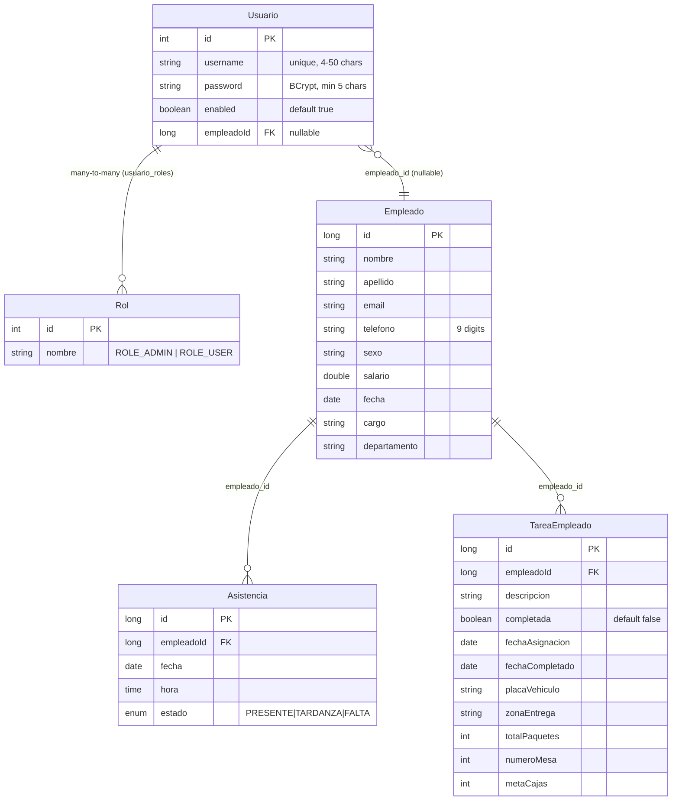

# API de Microservicios - Control de Empleados

## Base URL

```
http://localhost:8080
```

Todos los endpoints pasan por el API Gateway. Incluir `Authorization: Bearer <token>` en cada request (excepto `/api/auth/login` y `/api/auth/register`).

---

## Autenticacion

### Login

```
POST /api/auth/login
```

**Body:**
```json
{
  "username": "admin",
  "password": "12345"
}
```

**Response 200:**
```json
{
  "token": "eyJhbGciOiJIUzI1NiJ9...",
  "username": "admin",
  "roles": ["ROLE_ADMIN"]
}
```

El token expira en 8 horas.

---

### Registro de usuario

```
POST /api/auth/register
```

**Body:**
```json
{
  "username": "jperez",
  "password": "123456",
  "empleadoId": 1
}
```

`empleadoId` es opcional. Si se omite, el usuario queda sin empleado vinculado.

**Response 200:**
```json
{ "success": "Usuario registrado correctamente" }
```

**Response 400:**
```json
{ "error": "El nombre de usuario ya existe" }
```

---

### Validar token

```
GET /api/auth/validate
Authorization: Bearer <token>
```

**Response 200:**
```json
{ "valid": true }
```

---

## Empleados

### Crear empleado

```
POST /api/empleados
```

**Body:**
```json
{
  "nombre": "Juan",
  "apellido": "Perez",
  "email": "jperez@correo.com",
  "telefono": "987654321",
  "sexo": "Masculino",
  "salario": 2500.00,
  "fecha": "2025-06-01",
  "cargo": "Repartidor",
  "departamento": "Logistica"
}
```

**Validaciones:**
| Campo | Regla |
|---|---|
| `nombre` | No vacio |
| `apellido` | No vacio |
| `email` | Formato email valido |
| `telefono` | Exactamente 9 digitos |
| `sexo` | No vacio |
| `salario` | No nulo |
| `fecha` | Formato `yyyy-MM-dd` |
| `cargo` | No vacio |
| `departamento` | No vacio |

**Response 201:** Empleado creado con `id` asignado.

**Response 400:** Errores de validacion.

```json
{
  "nombre": "no debe estar vacio",
  "email": "debe ser una direccion de correo electronico con formato correcto"
}
```

---

### Listar empleados

```
GET /api/empleados
GET /api/empleados?page=0&size=5
GET /api/empleados?search=juan&page=0&size=5
```

| Param | Tipo | Default | Descripcion |
|---|---|---|---|
| `page` | int | 0 | Numero de pagina (0-based) |
| `size` | int | 5 | Registros por pagina |
| `search` | string | - | Busca en nombre, apellido, email, sexo, telefono |

**Response 200:**
```json
{
  "content": [
    {
      "id": 1,
      "nombre": "Juan",
      "apellido": "Perez",
      "email": "jperez@correo.com",
      "telefono": "987654321",
      "sexo": "Masculino",
      "salario": 2500.00,
      "fecha": "2025-06-01",
      "cargo": "Repartidor",
      "departamento": "Logistica"
    }
  ],
  "pageable": { ... },
  "totalPages": 1,
  "totalElements": 1,
  "number": 0,
  "size": 5
}
```

---

### Obtener empleado

```
GET /api/empleados/{id}
```

**Response 200:** Objeto empleado.
**Response 404:** No encontrado.

---

### Actualizar empleado

```
PUT /api/empleados/{id}
```

**Body:** Igual que en crear (todos los campos requeridos).

**Response 200:** Empleado actualizado.
**Response 404:** No encontrado.

---

### Eliminar empleado

```
DELETE /api/empleados/{id}
```

**Response 204:** Sin contenido (eliminado).

---

### Estadisticas

```
GET /api/empleados/count
```

**Response 200:**
```json
15
```

```
GET /api/empleados/departamentos
```

**Response 200:**
```json
{
  "Logistica": 6,
  "Produccion": 5,
  "Ventas": 4
}
```

```
GET /api/empleados/sexos
```

**Response 200:**
```json
{
  "Masculino": 10,
  "Femenino": 5
}
```

---

### Exportar PDF

```
GET /api/empleados/export/pdf
```

**Response 200:** Archivo PDF (landscape A4) con todos los empleados. Headers de respuesta incluyen `Content-Disposition: attachment; filename=empleados_<fecha>.pdf`.

---

## Asistencias

### Registrar asistencia

```
POST /api/asistencias
```

**Body:**
```json
{
  "empleadoId": 1,
  "fecha": "2026-06-16",
  "hora": "08:30:00",
  "estado": "PRESENTE"
}
```

| Campo | Tipo | Descripcion |
|---|---|---|
| `empleadoId` | Long | ID del empleado (requerido) |
| `fecha` | LocalDate | `yyyy-MM-dd`. Si se omite, se usa la fecha actual |
| `hora` | LocalTime | `HH:mm:ss`. Si se omite, se usa la hora actual |
| `estado` | Enum | `PRESENTE`, `TARDANZA`, `FALTA`. Default: `PRESENTE` |

**Response 201:** Asistencia creada.

---

### Listar asistencias de un empleado

```
GET /api/asistencias/empleado/{empleadoId}
```

**Response 200:**
```json
[
  {
    "id": 1,
    "empleadoId": 1,
    "fecha": "2026-06-16",
    "hora": "08:30:00",
    "estado": "PRESENTE"
  }
]
```

---

### Conteo de asistencias hoy

```
GET /api/asistencias/count/hoy
```

**Response 200:**
```json
{ "count": 8 }
```

---

### Exportar PDF de asistencias

```
GET /api/asistencias/export/pdf/empleado/{empleadoId}?nombreEmpleado=Juan%20Perez
```

**Response 200:** Archivo PDF (portrait A4) con tabla de asistencias del empleado, colores por estado, y resumen de totales.

---

### Eliminar asistencia

```
DELETE /api/asistencias/{id}
```

**Response 204:** Sin contenido.

---

## Tareas

### Crear tarea

```
POST /api/tareas
```

**Body:**
```json
{
  "empleadoId": 1,
  "descripcion": "Entregar pedidos zona norte",
  "placaVehiculo": "ABC-123",
  "zonaEntrega": "Norte",
  "totalPaquetes": 25,
  "numeroMesa": null,
  "metaCajas": null
}
```

| Campo | Tipo | Obligatorio |
|---|---|---|
| `empleadoId` | Long | Si |
| `descripcion` | String | Si |
| `placaVehiculo` | String | No |
| `zonaEntrega` | String | No |
| `totalPaquetes` | Integer | No |
| `numeroMesa` | Integer | No |
| `metaCajas` | Integer | No |

La `fechaAsignacion` se asigna automaticamente a la fecha actual.

**Response 201:**
```json
{
  "id": 1,
  "empleadoId": 1,
  "descripcion": "Entregar pedidos zona norte",
  "completada": false,
  "fechaAsignacion": "2026-06-16",
  "fechaCompletado": null,
  "placaVehiculo": "ABC-123",
  "zonaEntrega": "Norte",
  "totalPaquetes": 25,
  "numeroMesa": null,
  "metaCajas": null
}
```

---

### Listar tareas de un empleado

```
GET /api/tareas/empleado/{empleadoId}
```

Ordenadas por fecha de asignacion descendente.

---

### Tareas pendientes

```
GET /api/tareas/empleado/{empleadoId}/pendientes
```

Solo devuelve las no completadas.

---

### Marcar tarea como completada

```
PUT /api/tareas/{id}/completar
```

Asigna `completada = true` y `fechaCompletado` a la fecha actual.

**Response 200:** Tarea actualizada.

---

### Eliminar tarea

```
DELETE /api/tareas/{id}
```

**Response 204:** Sin contenido.

---

## Modelo de datos



---

## Bases de datos

| Servicio | Base de datos | Tablas |
|---|---|---|
| auth-service | `auth_db` | `usuarios`, `roles`, `usuario_roles` |
| empleado-service | `empleados_db` | `empleados` |
| asistencia-service | `asistencias_db` | `asistencia` |
| tarea-service | `tareas_db` | `tareas_empleado` |

Todas con `ddl-auto=update`, las tablas se crean automaticamente al iniciar cada servicio.

---

## Roles y permisos

| Rol | Permisos |
|---|---|
| `ROLE_ADMIN` | CRUD completo en empleados, tareas, asistencias. Exportar PDFs. Dashboard. |
| `ROLE_USER` | Ver su panel, completar sus tareas, ver sus asistencias. |

El usuario `admin` / `12345` con rol `ROLE_ADMIN` se crea automaticamente al iniciar `auth-service`.

---

## Codigos de respuesta

| Codigo | Significado |
|---|---|
| 200 | OK |
| 201 | Creado |
| 204 | Sin contenido (eliminado correctamente) |
| 400 | Error de validacion |
| 401 | No autorizado (token ausente o invalido) |
| 404 | Recurso no encontrado |

---

## Postman Collection

Para importar en Postman, crear una coleccion con las siguientes variables:

| Variable | Valor inicial |
|---|---|
| `base_url` | `http://localhost:8080` |
| `token` | (vacio, se llena tras hacer login) |

Configurar el `Authorization` de la coleccion como `Bearer Token` con valor `{{token}}`.

### Pre-request script sugerido

```javascript
if (pm.request.url.getPath() !== '/api/auth/login' &&
    pm.request.url.getPath() !== '/api/auth/register') {
    if (!pm.variables.get('token')) {
        console.log('Token no configurado - ejecuta /api/auth/login primero');
    }
}
```
